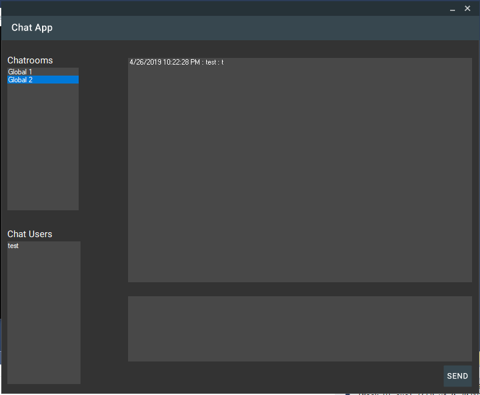
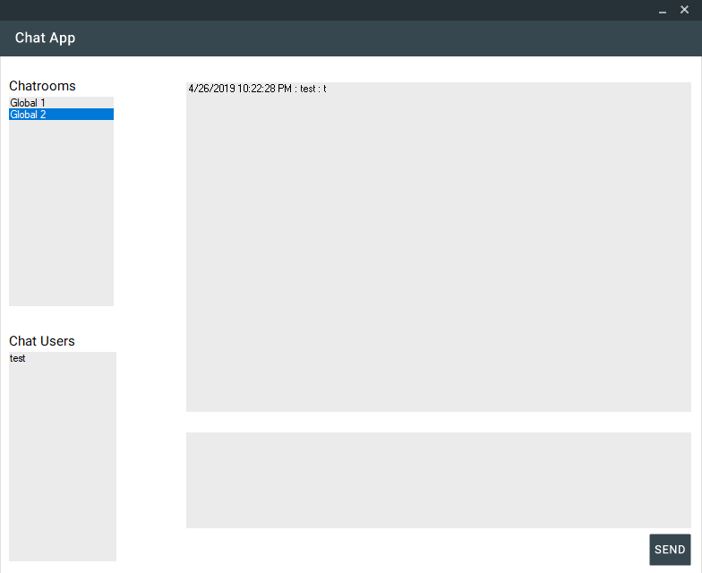

# Chat App

SE3330 Team NullReferenceException

Our project is a chat app that uses a server and a client to connect users and allow them to talk to each other. The server 
uses a relational database to store user login information (SHA1 password hashing) as well as persistant chatroom information.
Users have the ability to create public and private chatrooms and are notified of new messages. The program features a material 
design theme, along with a dark mode and light mode.





## Before running the project

check to make sure any/all of these libraries are properly included in the necessary projects.

The client and server both rely on Json serializing, the project should already include the necessary libraries. If the libraries are missing, follow these instructions:

In Visual Studios, navigate to 
```
project > Manage NuGet Packages > Browse

Search  and install the "Newtonsoft" json library.
```

The Client relies on Moq for unit testing.

```
project > Manage NuGet Packages > Browse

Search  and install the "Moq" library.
```

The Server relies on an Oracle library to connect and run commands on the SqlServer.

```
project > Manage NuGet Packages > Browse

Search  and install the "Oracle.ManagedDataAccess" library.
```

## Starting the Application

Open up the Server project and client project Visual Studio.

Build the client and run the executable from the bin folder to run multiple clients.

Start the server (from the .exe or project, either works) before starting any clients as the client(s) will try to connect to the server during startup.

